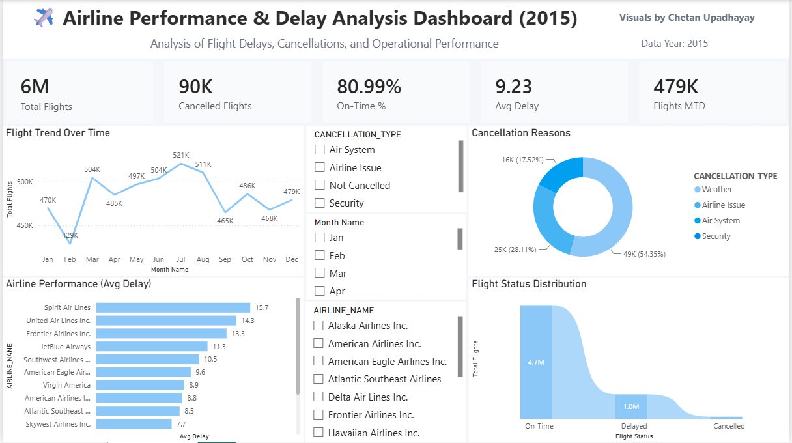

# ✈️ Airline Performance & Delay Analysis Dashboard (2015)

Interactive Power BI dashboard analyzing **2015 US Airline flight delays, cancellations, and operational performance**.  
Built using Kaggle's flight dataset covering all major US domestic flights.

---

## 📊 Dashboard Preview

> *Visuals by Chetan Upadhyay*

---

## 🎯 Business Questions Answered

- What is the overall on-time performance across all airlines?
- Which airlines have the highest average delay minutes?
- How do flight volumes trend month by month?
- What are the primary reasons for flight cancellations?
- How are flights distributed across On-Time, Delayed, and Cancelled status?

---

## 🛠️ Tools & Technologies

| Tool | Purpose |
|------|---------|
| Power BI | Interactive dashboard and visualization |
| Kaggle | Dataset source |

---

## 📦 Dataset

- **Source:** [Kaggle — 2015 Flight Delays and Cancellations](https://www.kaggle.com/datasets/usdot/flight-delays)
- **Period:** January 2015 – December 2015
- **Coverage:** All major US domestic flights

---

## 📈 Key Metrics (2015)

| KPI | Value |
|-----|-------|
| Total Flights | 6 Million |
| Cancelled Flights | 90K |
| On-Time Rate | 81% |
| Avg Delay | 9.23 minutes |
| Flights MTD | 479K |

---

## 🔍 Key Insights

- ✈️ **Most Delayed Airline:** Spirit Air Lines — 15.7 min avg delay
- 🟢 **Best Performer:** Skywest Airlines — only 7.7 min avg delay
- ❌ **Top Cancellation Reason:** Weather — 54.35% of all cancellations
- 🌀 **Airline Issues:** 28.11% of cancellations caused by airline
- 📅 **Peak Traffic Month:** July — 521K flights
- 📉 **Lowest Traffic:** February — 429K flights
- 🛫 **Flight Status:** 4.7M On-Time | 1.0M Delayed | 90K Cancelled

---

## 📊 Dashboard Visuals

| Visual | Description |
|--------|-------------|
| KPI Cards | Total Flights, Cancelled Flights, On-Time %, Avg Delay, Flights MTD |
| Line Chart | Flight Trend Over Time — monthly volume Jan to Dec |
| Bar Chart | Airline Performance by Avg Delay (top 10 airlines) |
| Donut Chart | Cancellation Reasons — Weather, Airline Issue, Air System, Security |
| Area Chart | Flight Status Distribution — On-Time, Delayed, Cancelled |
| Slicers | Filter by Cancellation Type, Month, Airline Name |

---

## ⚙️ How to Use

1. Download dataset from Kaggle link above
2. Open Power BI Desktop
3. Load flights, airlines, and airports CSV files
4. Use slicers to filter by Month, Airline, or Cancellation Type

---

## 👨‍💻 Author

**Chetan Upadhyay**  
Aspiring Data Analyst  
📧 chetanupadhayay24@gmail.com  
🔗 [linkedin.com/in/chetan-upadhayay](https://www.linkedin.com/in/chetan-upadhayay)

---

*Dataset courtesy of US Department of Transportation on Kaggle*
